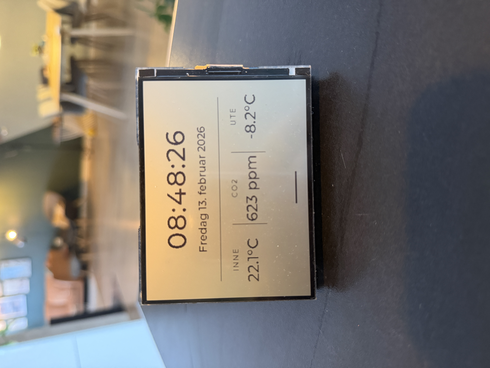

# Dashy

Dashy is a custom dashboard firmware for the Waveshare ESP32-S3-RLCD-4.2 (400x300) board.
It shows:
- clock and date (Norwegian locale text)
- indoor temperature
- outdoor temperature
- CO2 (from Netatmo)

This repo is structured so other ESP32-S3-RLCD-4.2 owners can clone, configure secrets, and flash quickly.

## Example output
Real device photo:

## Hardware
- Waveshare ESP32-S3-RLCD-4.2
- USB-C cable

## Firmware source
- Main sketch: `firmware/arduino/08_LVGL_V8_Test/08_LVGL_V8_Test.ino`
- Driver/support files in the same folder are based on Waveshare's official example package.

## Quick start (Arduino IDE)
1. Install Arduino IDE 2.x.
2. Install board package `esp32:esp32` version `3.3.6`.
3. Install libraries:
   - `lvgl` version `8.4.0`
   - `ArduinoJson` version `7.x`
4. Copy `firmware/arduino/08_LVGL_V8_Test/secrets.h.example` to `firmware/arduino/08_LVGL_V8_Test/secrets.h` and fill in values.
5. Open `firmware/arduino/08_LVGL_V8_Test/08_LVGL_V8_Test.ino` in Arduino IDE.
6. Apply board settings from `docs/board-settings.md`.
7. Upload.

## Quick start (CLI)
- Compile: `./scripts/compile.sh`
- Upload: `./scripts/upload.sh /dev/cu.usbmodem2101`
- Probe connected board info: `./scripts/probe-device.sh /dev/cu.usbmodem2101`
- Dump app signatures from flash: `./scripts/dump-app-signatures.sh /dev/cu.usbmodem2101`

## Documentation
- Getting started: `docs/getting-started.md`
- Board/tool settings: `docs/board-settings.md`
- Netatmo setup/API mapping: `docs/netatmo-api.md`
- Exact current screen behavior/code: `docs/current-screen.md`
- Device verification from current hardware: `docs/device-verification.md`
- Upstream references: `docs/upstream.md`

## Open-source notes
- Secrets are excluded from git via `.gitignore` (`**/secrets.h`).
- If any credentials were previously committed, rotate them before publishing.
- See `docs/upstream.md` for attribution and licensing caveats.
